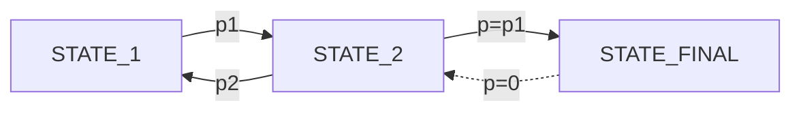

## Terminate vs truncate
 
Read https://gymnasium.farama.org/tutorials/gymnasium_basics/handling_time_limits/

Basically, **terminate** is when that node (or state) in markov is a final node wich **is reachable but it is one-way and final step** so it is not reversible (ProbabilityBack=0), examples: success or rewarded time_limit resoution . A **truncated** is a node that is not in the markov chain, and we are **externally forced to finish**, examples out of bounds or when a timeout is set to prevent infinite steps. 

The difference in learning is this paragraph in the link above: *This is where the distinction between termination and truncation becomes important. When an episode ends due to termination we don’t bootstrap, when it ends due to truncation, we bootstrap.*

## Sequence optimization

In PPO it is important the policy but also the critic actor which uses DQN. For policy, do not forget to implement the env to provide deterministic triplets (obs->action->reward) because a trajectory T={(o,a,r), (o,a,r)...} and the NN optimizes (maximizes) all the trajectories know NN={maxT1, MaxT2,...}. For critic, q-learning table and dqn applies.

## Observation space size

After experience with SimpleBinary env, never use a size=1 observation space, since it is only n input node in the neural network, use several observations of smaller range (eg 10 booleans vs 1 integer capped to 0-10), the training is worse in the initial steps but it detects features later for the outputs, in this case, the actions.

## To double-check

Check in DRL if inputs in the NN are the observation items and outputs are the actions. If so, chek plain NN how behaves when 1 uint_8 and 8 inputs uint_1 because that can explain why expanding space is better and why cumulative finds good partials faster than atomic even if final convergece is worse. 
